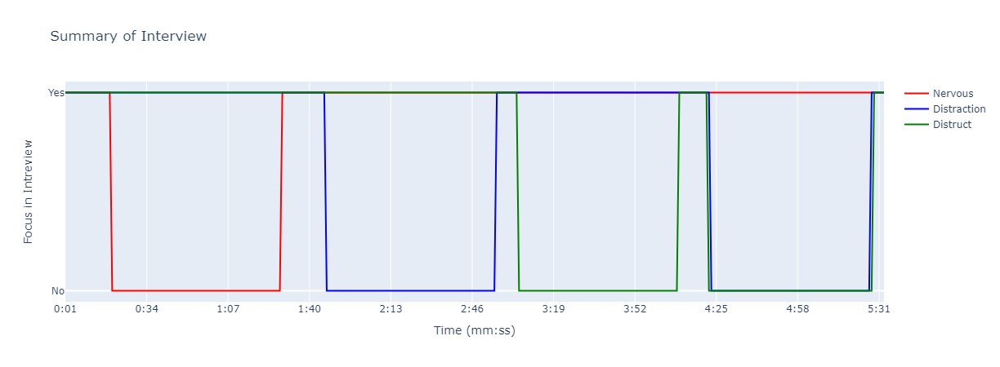
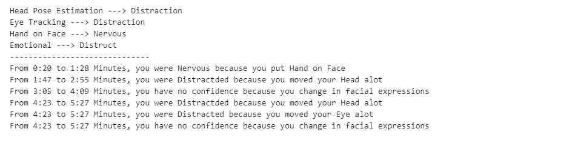

# 🧠 Body Language Analysis System for Interview Evaluation

This project is a real-time computer vision system that analyzes non-verbal behaviors in interviews to provide behavioral feedback. It detects **facial emotions**, **eye gaze**, **head pose**, and **hand-to-face gestures** using computer vision and deep learning.

---

## 📂 Modules Overview

| Module | Purpose |
|--------|---------|
| 👁️ Eye Tracking & Blink Detection | Tracks eye gaze (left, center, right) and detects blinking using facial landmarks and EAR. |
| 😐 Emotion Recognition | Uses EmotiEffNet (ONNX) to classify facial expressions in real-time. |
| 🧭 Head Pose Estimation | Estimates head orientation (pitch, yaw) and determines direction of gaze. |
| ✋🤚 Hand-to-Face Detection | Detects hand touching the face using distance between hand and face landmarks. |
| 🚨 Behavioral Alert System | Triggers alerts based on sustained behaviors like staring, face-touching, or static emotion. |

---

## 🛠️ Features

### 👁️ Eye Tracking and Blink Detection

- Uses MediaPipe face mesh and iris landmarks.
- **Blink Detection** using Eye Aspect Ratio (EAR).
- **Gaze Direction** using averaged eye and iris positions:
  - Eye center = average of eye boundary landmarks.
  - Iris center = average of iris landmarks.
  - Compares position to determine if user is looking **left**, **right**, or **center**.

### 😐 Facial Emotion Recognition

- Uses **EmotiEffNet (ONNX)** for real-time facial expression classification.
- Emotions detected: *Happy, Sad, Angry, Neutral*, etc.
- Integrated with **MediaPipe** face detection for fast ROI extraction.

### 🧭 Head Pose Estimation

- Estimates head orientation using OpenCV’s `solvePnP()` from 2D-3D landmark mapping.
- Euler angles (pitch, yaw) used to classify head pose:
  - Yaw < –10° → Looking Left
  - Yaw > +10° → Looking Right
  - Pitch > +10° → Looking Up
  - Pitch < –10° → Looking Down
  - Near zero → Looking Forward

### ✋🤚 Hand-to-Face Gesture Detection

- Detects hand proximity to the face using MediaPipe hand and face landmarks.
- If a hand landmark lies within ±30 pixels of any facial landmark → Hand touching face.
- Interpreted as **stress** or **nervousness**.

### 🚨 Behavioral Alert System

Triggers alerts when a condition is sustained for more than **10 seconds**:

| Behavior | Condition | Interpretation |
|----------|-----------|----------------|
| Hand on Face | Contact >10s | Nervousness or discomfort |
| Fixed Head Pose | Static >10s | Fatigue or disengagement |
| Fixed Gaze | Centered >10s | Zoning out or boredom |
| Neutral Emotion | No change >10s | Low engagement |

---

## 📊 Result of Feedback

### 🧾 1. Behavior Summary Table (Every 10 seconds)

Summarizes real-time behavior logs:

